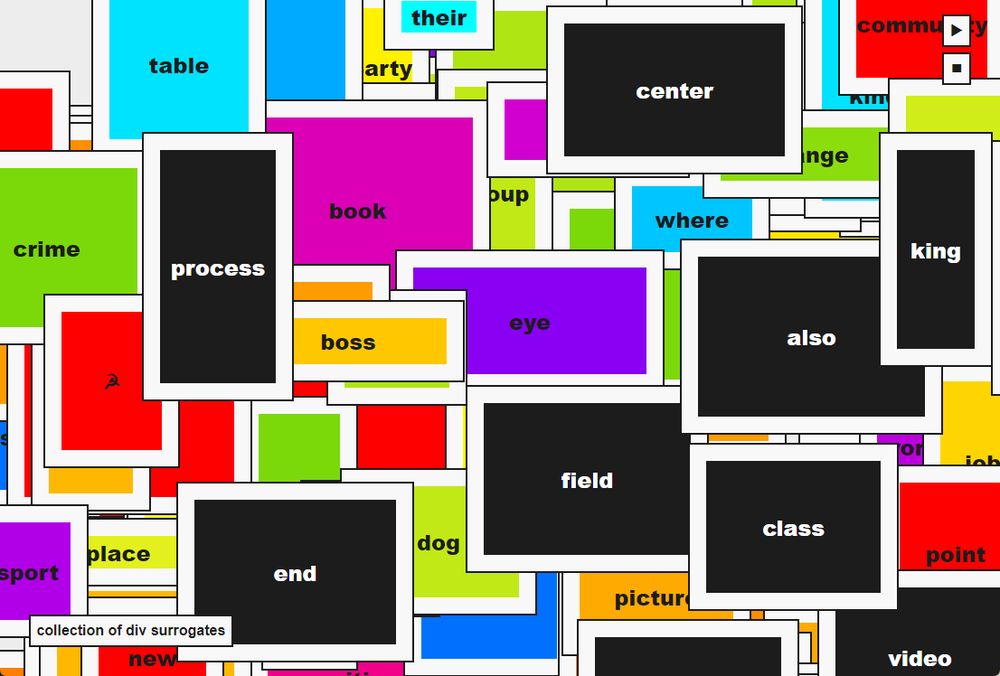

# collection of div surrogates

A piece of web art by Michael Kolesidis.

It makes use of the [DOM Window Manager](https://www.npmjs.com/package/dom-window-manager), a tiny library created by me.

Inspired by the work _[Collection of Forty Plaster Surrogates](https://www.moma.org/collection/works/79653)_ (1982) by [Allan McCollum](http://allanmccollum.net/allanmcnyc/)

## License

Copyright (c) Michael Kolesidis

Reproduction of any of the artwork on this website
for commercial use is not permitted without first
receiving written permission from the artist. You
cannot host, display, distribute or share this Work
in any form, including physical and digital. You
cannot use this Work in any commercial or non-commercial
product, website or project. You cannot sell this Work and
you cannot mint an NFTs of it.

Under the Copyright Law, it is fair use to reproduce a single
copy for personal or educational purposes, provided that no
changes are made to the content and provided that a copyright
notice attesting to the content is attached to the reproduction.
Beyond that, no further copies of works of art may be made or
distributed on this website without written permission.
